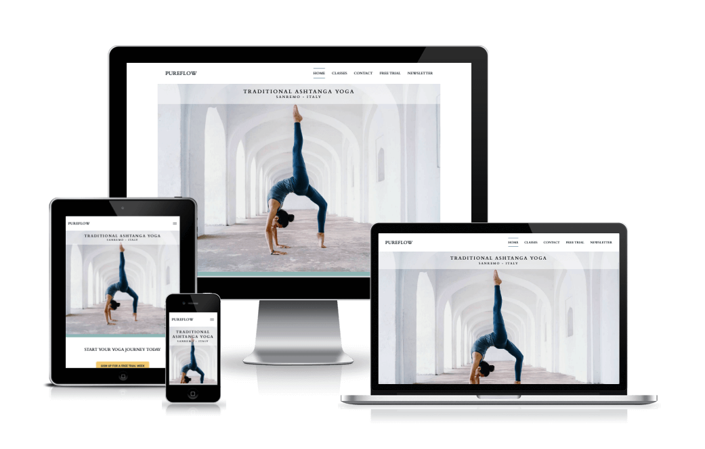
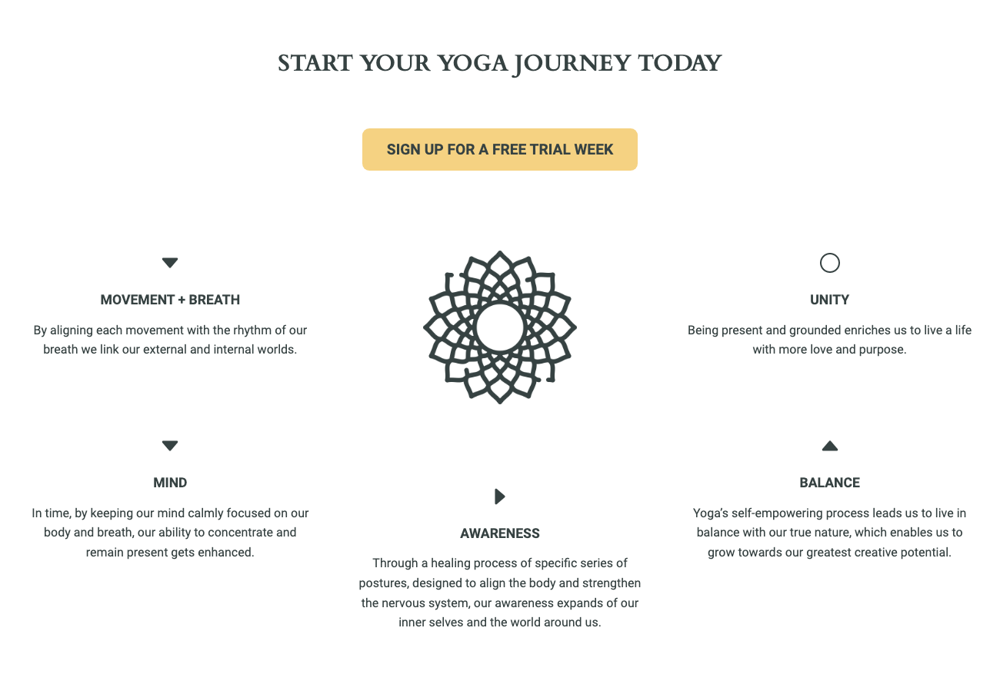
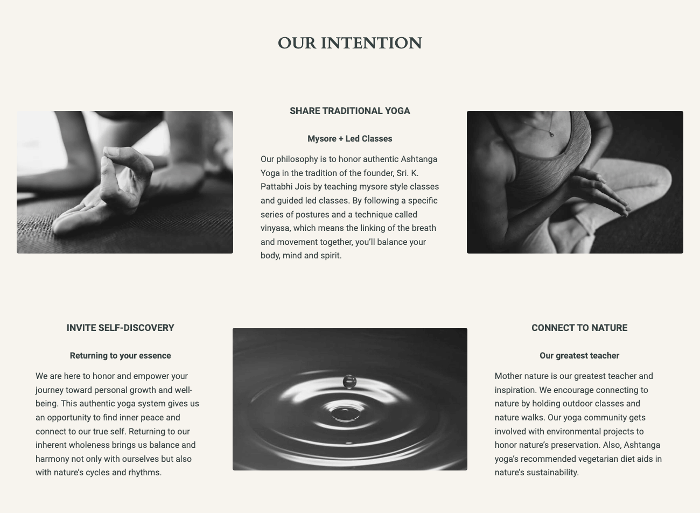
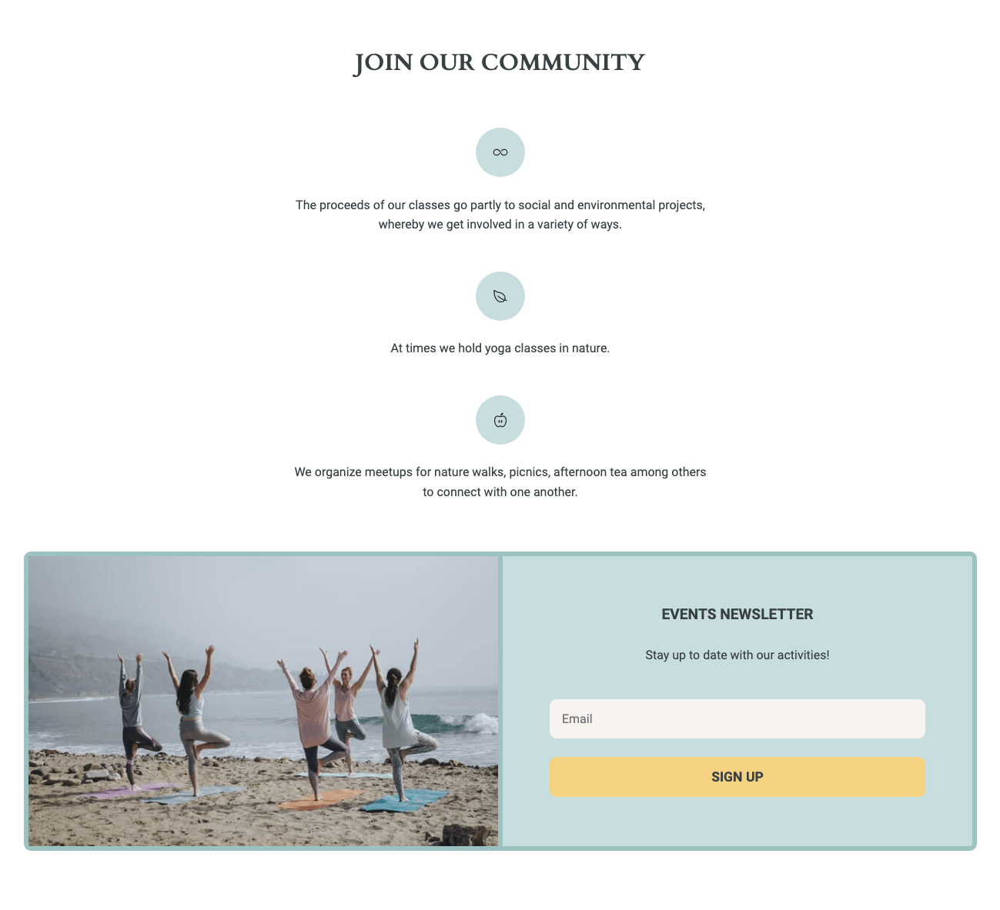
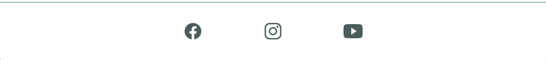
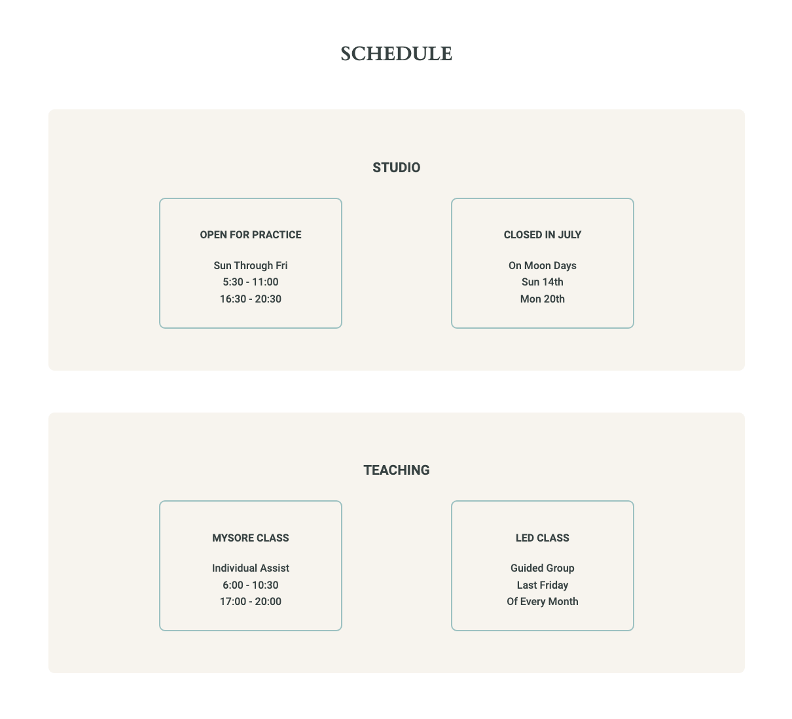
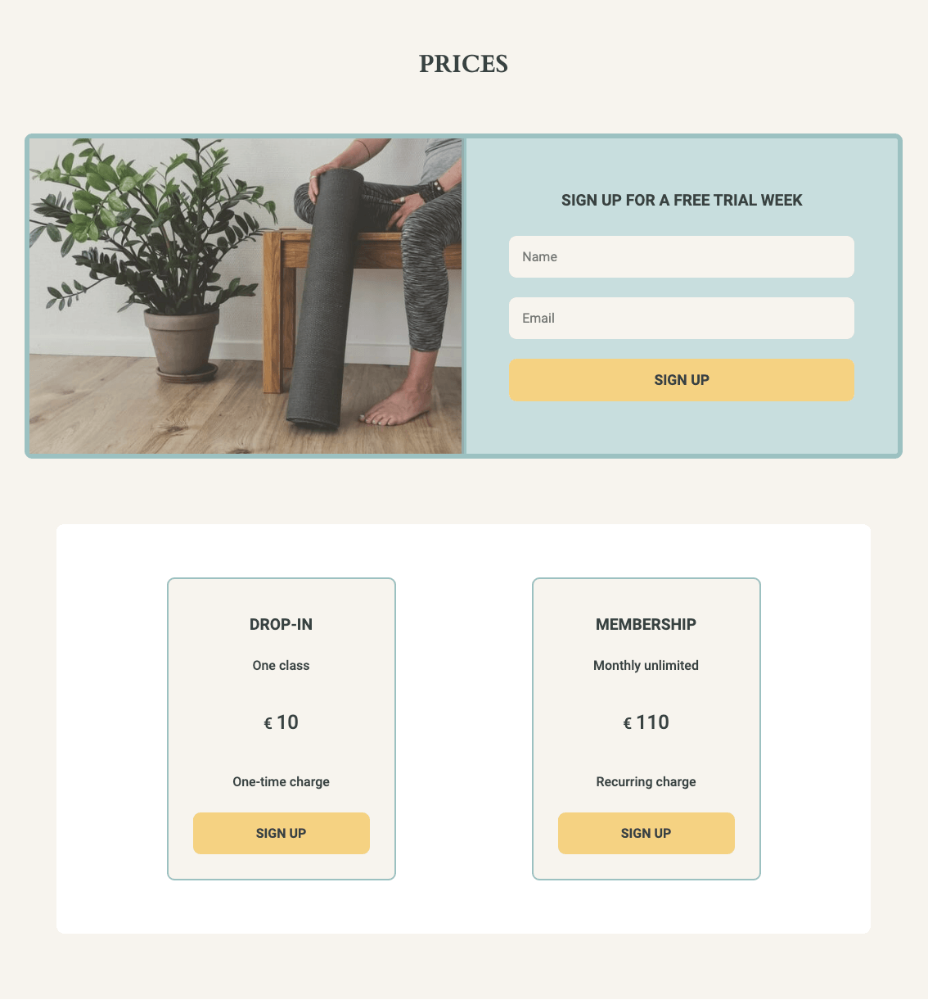
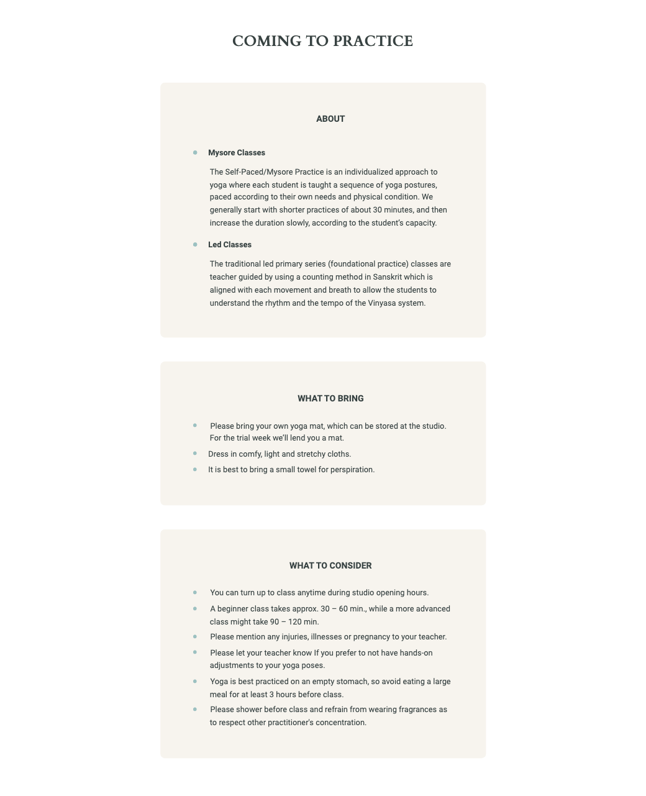
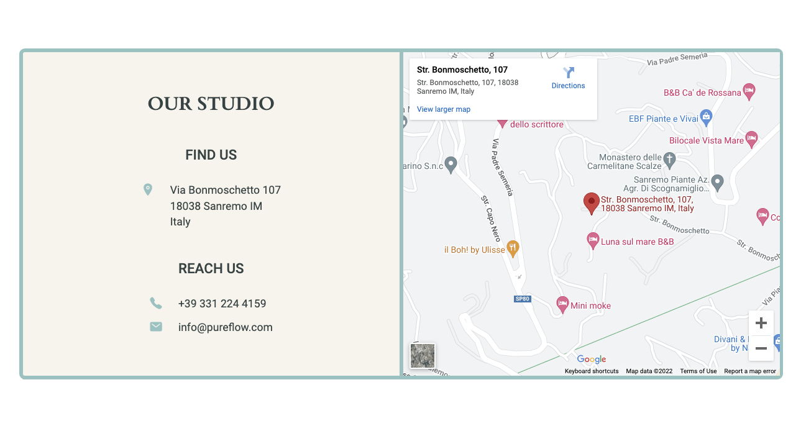
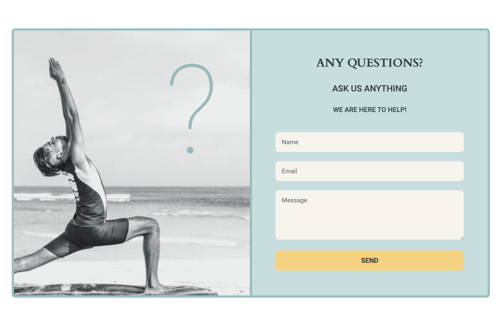

# PUREFLOW

Pureflow is a mobile-first website that aims to promote authentic Ashtanga Yoga taught in the tradition of its founder Sri. K. Pattabhi Jois. This Indian yoga guru developed a unique flowing style of yoga known as Ashtanga vinyasa yoga, by which one links the breath and movement together to balance one's body, mind and spirit. The Pureflow website hopes to communicate the ultimate benefits of an Ashtanga yoga practice and the journey that one can experience towards a more present and grounded self. 

Pureflow is a website that will target first-time and experienced yogis and yoginis who are visiting or are located in Sanremo Italy. Pureflow will be useful for those who are looking to practice yoga in an authentic way, as how it is still taught in India today. Pureflow's goal is to create a community that connects to mother nature, who is our greatest teacher and inspiration to live a balanced life, to benefit ourselves and the world as a whole. Therefore, Pureflow will also be useful for those who are looking to connect with others for the greater good. 

## Project Goals

- To establish an online presence for Pureflow.
- To design a website with excellent user experience as a driving force, whereby the user has easy access to the required information throughout the site.
- To provide the user with practical information in a concise manner to add to a great user experience. 
- To design a website with a beautiful user interface that adds to the ux design and doesn't take away from it's goal.
- To design a website with an user interface that clearly communicates Pureflow's values and brand.
- To inform the user on the benefits and the process of an authentic Traditional Ashtanga Yoga practice.
- To entice users to start a yoga practice with the Pureflow yoga studio.
- To inform the user on the benefits of joining the Pureflow community.
- To entice users to sign up for the community Events Newsletter. 
- To provide the user easy access to Pureflow's social media presence.

## Features

### Existing Features

- **Navigation Bar**

    - Featured on all three pages, the full responsive navigation bar includes links to the Logo, Home page, Classes page, Contact page, Free Trial form and Newsletter form. They are displayed identical on all the three pages and remain visible at the top of the browser's viewport even while scrolling down the page to allow for an easy navigation user experience. 
    - The currently visited page is highlighted at all times so the user has clarity on what page they are currently on. 
    - This section will allow the user to access all the pages and signup forms from each individual page and across all devices without having to use the 'back' button to navigate to a previous page.
    - On smaller screens the navigation bar is collapsed, but remains easily accessible in the top right hand corner.

- **Landing Page Image**

    - The Landing section features a striking hero image of a woman performing a backbend yoga pose. The image's background displays a receding focal point encompassing the subject. The image was purposely chosen to convey Pureflow's website theme. Backbend poses are heart-opening poses on the spiritual level and Pureflow's goal is to invite self-discovery to connect to our true self on our yoga journey. The white walled receding background of the image portrays beautifully the purifying spiritual journey that one is invited to embark on. 
    - Besides the yoga image clearly communicating that Pureflow is a yoga site, the text overlay allows the user to immediately see the type of yoga that is being promoted and also the location the site is applicable to.
    - The image has a bottom primary color of a warm blue tone to help give the site hero image a warmer welcoming feel.

- **Journey Section**

    - The Journey section invites the user to start their yoga journey today, followed by the steps in the yoga journey process. As a first step, Pureflow invites and encourages the user to sign up for a free trial week, by using a large warmish tone yellow button that clearly stands out from its surroundings and gives a friendly inviting feel.
    - This section aims to communicate to the user what healing and enriching process one can expect from an Ashtanga yoga practice journey. 
    - The direction of the journey is signified by using an arrow icon that in ancient Hindu symbolizes physical strenght, perseverance, psychological prowess and concentration, which exactly describes what an Ashtanga practice embodies. The end of the journey is represented by a circle, which symbolizes union, the gift of being in balance with our true nature and living a life with more love and purpose.
    - The center image was chosen to encapsulate the journey's theme, as the Sahasrara symbol represents the opening of the spiritual self the way a lotus opens itself to the sun. By which the yellowish button above is perfectly complementary. 

- **Intention Section**

    - The Intention section aims to communicate to the user the Pureflow yoga community's values by clearly stating three titles and sub-titles with further explanations and accompanying images. 
    - This transparent disclosure helps to present a distinct Pureflow brand, which is important to establish the user's trust.
    - The warm yellowish toned background is used to show a welcoming friendly community within the scope of a very traditional yoga practice. The latter is conveyed by the grayscale images.

- **Community Section**

    - The Community section invites the Pureflow website user to join its community by listing its community's features with friendly rounded icons followed by a brief description of its actions and benefits.
    - Once again this transparent communication helps to make the user feel at ease, which is important to Pureflow's goal of having users join their community.
    - After a clear concise description list of what being part of the Pureflow community entails, Pureflow invites its users to sign up for an Events Newsletter to stay up to date with the community's activities. 
    - The Events Newsletter form is designed with soft soothing warm color tones to communicate a friendly welcoming vibe. The accompanying image also portrayes the calming embracing Pureflow community nature.
    - The Events Newsletter form only asks for an email input and a name input was omitted intentionally to create the least amount of friction for the user. Not only will this help Pureflow's goal to have more users sign up, but it also creates an enjoyable user experience with less initial commitment and exposure on the user's end. 

- **Footer**

    - The Footer section displays links to the relevant social media sites for Pureflow. The links are designed to open in a new tab to create a good user experience, whereby the Pureflow website remains easy to access.
    - The footer section design has a top border to create a clear seperation from the above section. 
    - The footer is of value to the user as it motivates the user to connect through social media and creates another low friction access point to Pureflow's community. This can encourage users that need more time to decide to join the Pureflow studio and community. It allows them to take their time to get to know the community better from a distance before joining. Ultimately, this is also of value to the Pureflow's goal of having more people join their community.

 

 - **Classes Page**

    - The Classes page features a header clearly displaying the current page. The header is the same color as the Hero Image's bottom border, to create a uniform design throughout the site. 
    - The user will be able to locate information on the studio's schedule and Pureflow's prices. There is also information provided on the type of classes Traditional Ashtanga yoga provides. Lastly the page displays info on what to bring to practice and what to consider when coming to practice. 

- **Schedule Section**

    - This section start with a clear large title, so the user can easily locate this section on the page.
    - The Schedule section privides information in a concise manner, to create an enjoyable user experience as to find the relevant information easily without much friction.
    - The Schedule section provides two tables. One table displaying the studio opening and closing times. The other table displaying the times different type of classes are held.

- **Prices Section**

    - The Prices section features the same clear title design, to be easily located by the user.
    - This section firstly displays the 'Free Trial Week Sign Up' form. Its colors are soft and inviting, while also standing out from the page to promote an action on the user's end. It is joined by an image of a yogini about to join a yoga class.
    - Underneath the form the two price options are displayed, with a clear consise description and yellow sign up button.

- **Practice Section**

    - The Practice section has a clear and large title design, to be easily located by the user.
    - This section features three sub-sections to clearly communicate the different types of information pertaining to when a user decides to come to practice. All sub-sections have their seperated colored background to give an easy visual distinction. Each list point in the sections has been designed with a primary color dot to help the user more easily locate the different list points. The design also helps to create a friendlier tone with the soft color choice.
    - The About sub-section provides a discription about the different type of classes.
    - The What To Bring sub-section clearly informs the user what to bring to class.
    - The What To Consider sub-section provides the user with useful information that is important to know, before coming to class. This will help create a good user experience as the user will be properly informed.

- **Contact Page**

    - The Contact page features a header clearly displaying the current page. The header is the same color as the Hero Image's bottom border and the Contact page header, to create a uniform design throughout the site. 
    - The user will be able to locate information on where to find the studio and how to reach the studio. The Contact page provides the user with a form to submit any questions the user might have.

- **Studio Section**

    - The Studio section displays Pureflow's studio location by providing a clear sub-heading called Find Us and displaying below a location icon followed by the Pureflow's studio address. To help the user locate the studio more easily a google map is also provided.
    - The Studio section also displays Pureflow's contact details by providing another clear sub-heading called Reach Us and displaying below the phone number and email address accompanied with clear icons, so the user can easily spot the relevant information. 

- **Questions Section**

    - The Questions section gives the user the opportunity to have an easy user experience, by providing a form where the user can ask any questions. 
    - The form intentionally omitted the subject input, as to create less friction for the user filling out the form. One less thing to think about and do, helps in having a great user experience. 
    - The yellow designed button provides a visually clear action point. 
    - The form's accompanying image was designed with a large question mark that clearly and immediately signifies the form's purpose. It was designed largly to stand out, but with the same color of the border to maintain a soft cohesive visual display. 

### Features Left to Implement

- **Teacher Bio Section**

    - A Teacher Bio section would be helpful to gain the user's trust before coming to practice. 
    - This section would display the teachers pictures and their names. Underneath there would be mention of their yoga qualification, their own yoga Journey and also which teachers they practiced under. Finally, there would be a description of their personal teaching style.

- **Gallery Section**

    - A Gallery section would display images of Pureflow members practicing yoga at the Studio. This would allow the user to have a clear idea of what the studio looks like and how people practice. The gallery would encourage more users to come to class, as it would take away any concerns or worries the user might have when starting a new yoga practice at an unfamiliar yoga studio. 
    - The Gallery section would also display images of the Pureflow community participating in past events and activities. This section would aid in reflecting the community values and goals of having a beneficial environmental and social impact in the larger community of Sanremo, Italy. The Gallery would also communicate the welcoming, relaxed and friendly vibe of the Pureflow community and encourage more users to sign up for the Events Newsletter.

## Testing

The testing process can be viewed [here](testing.md).

## Deployment

- The website was deployed to GitHub pages. The steps taken to deploy were as follows:
    - In the GitHub relevant [Pureflow](https://github.com/vanderherten/pureflow) repository, at the top navigate to the Settings tab.
    - In the left vertical navigation menu navigate to the Pages tab.
    - Under the Build and Deployment section, select 'main' as the Branch option.
    - Press the Save tab.
    - The page will automatically refresh and after a few minutes a link to the live site will appear under the GitHub pages heading.
    - There is no difference between the deployed and development version of this website.

The live site can be found here - [Pureflow](https://vanderherten.github.io/pureflow/index.html)

## Credits

### Content

Most content was written by the developer.

- The Journey section and Intention section on the Home page: 
    - Some content ideas and wording were taken from [Ashtanga Yoga Teacher Aline Fernandes](http://alinefernandesyogini.com/)
        - The layout idea was used as inspiration and mostly reframed to make my own. 
        - Some content wording was used, but reframed to fit my own paragraph message. 
    - Some content was taken from [Ashtanga Yoga Teacher Eddie Stern](https://eddiestern.com/class-descriptions/)
        - In the Intention section for The Share Traditional Yoga sub-section, some content wording was used for the paragraph, but reframed to make my own. 
    - A CSS filter generator was used from [Barrett Sonntag Codepen](https://codepen.io/sosuke/pen/Pjoqqp)
        - The sahasrara symbol in the Journey Section was changed from black to the Journey section text color by using the css filter generator code
- The Practice section on the Classes page:
    - Some content was taken from [Ashtanga Yoga Teacher Eddie Stern](https://eddiestern.com/class-descriptions/)
        - A direct copy of content wording was used for the Mysore Class description.
    - Some content was taken from [Ashtanga Yoga Studio Brussels, Belgium](https://ashtanga.be/ashtanga/) and from [Ashtanga Yoga Studio Geneva, Switzerland](https://www.ashtangageneva.com/)
        - The Coming to Practice section's description content was inspired by these websites.
- The Studio secion on the Contact page:
    - Some content was taken from [Yoga Wellness Center, San Remo, Italy](https://www.shantisanremo.com/conttati)
        - A direct copy of the address and phone number was used for the sub-sections Find Us and Reach Us.
    - A HTML method was used to embed a responsive google map without google apis or further css styling. [Responsive google maps embed methods webpage](https://blog.duda.co/responsive-google-maps-for-your-website). [Responsive google maps embed method excerpt](assets/images-readme/images-testing/embed-google-map.png).
- The Icons in the Footer section on all the website's pages:
    - The icons were taken from open source [Ionicons](https://ionic.io/ionicons)

### Media

- Images on all the Pureflow webpages, except the Journey section:
    - All images were taken from [Unsplash](https://unsplash.com/)
- The Journey section sahasrara symbol:
    - The image was taken from [Flaticon](https://www.flaticon.com/)

## Acknowledgements

Thank you to my mentor for giving me positive motivation, guidance and support.

Thank you to [Code Institute](https://codeinstitute.net/) for their motivational support, guidance and information.

Thank you to the Slack community for their support throughout the process. 

 

