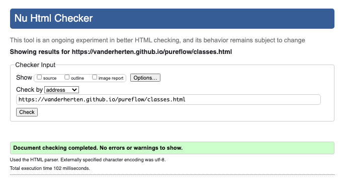
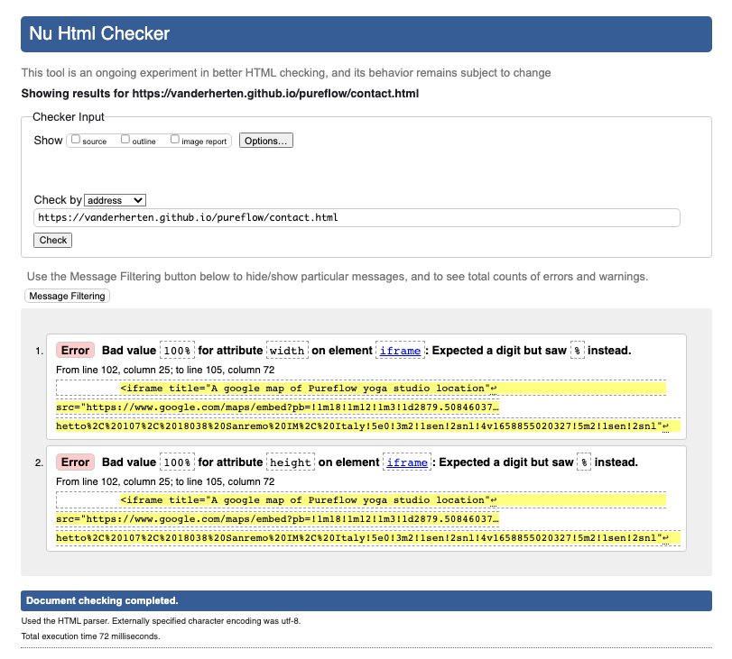
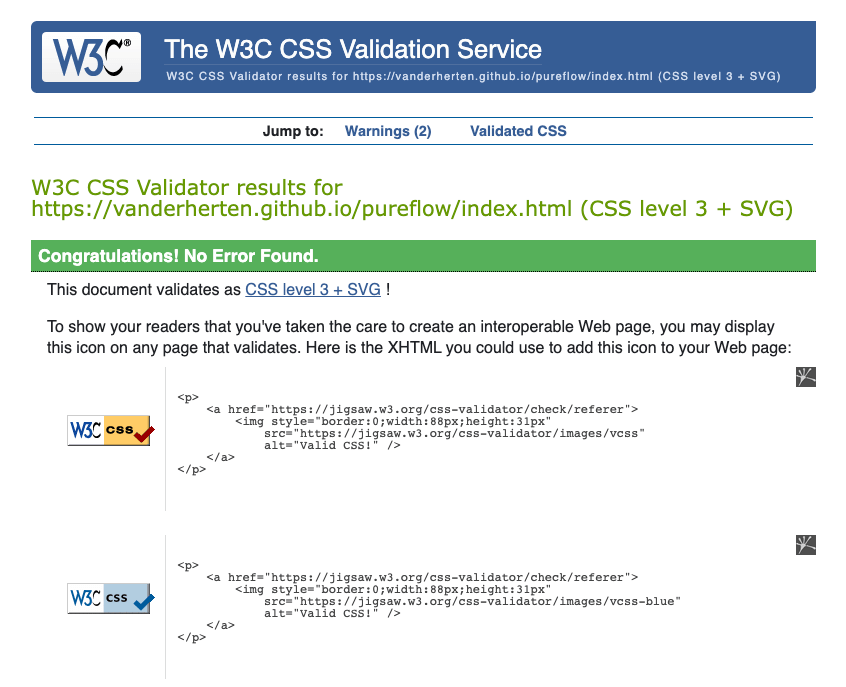

## Testing

### Validator Testing

- HTML:
    - [The W3C Markup Validation Service](https://validator.w3.org/) tool was used to validate all html files.
        - The warning and errors were fixed, which resulted in no errors found.
            - .
            - .  
            - There was a warning that the list role is unnecessary for element ul.
            - There was an error for a type attribute on the form inputs.
        - The Contact page returned an error, which I intentionally left unfixed.
            - . 
            - There was an error for value 100% on the attribute width and height on element iframe (google map).
            - A method was used to embed a responsive google map without google apis or further css styling. [Responsive google maps embed methods webpage](https://blog.duda.co/responsive-google-maps-for-your-website). [Responsive google maps embed method excerpt](assets/images-readme/images-testing/embed-google-map.png).
- CSS:
    - [The W3C CSS Validation Service](https://jigsaw.w3.org/css-validator/) tool was used to validate the CSS stylesheet.
        - The errors were fixed, which resulted in no errors found.
            - .
            - There was a syntax error for margin-top. 

### Website Functionality Testing

- Website:
    - I tested that all the pages work in different browsers:
        - Chrome, Firefox, Safari.
- Navigation links:
    - All navigation links were tested for desktop and mobile:
        - The primary navigation menu and logo link was tested to validate that all of the links work correctly.
        - The 'Sign Up For A Free Trial Week' button link was also tested to validate it worked correctly.
- Footer Social Media links:
    - All social media links were tested on all the web pages for desktop and mobile:
        - They were tested to make sure they opened up in a new tab.
- Forms:
    - All forms were tested:
        - By omitting input items or filling the form out incorrectly, whereby the correct feedback error got displayed.
        - By filling the form out correctly and getting a positive result from [Code Institute form validator](https://formdump.codeinstitute.net/).
        - The forms were also tested to see if the css design worked by which a blue border appeared on the active item and the button also appears darker on hovering over. These design elements give the user visual aids when using the website's features. 
        - The google map was tested on it's functionality to zoom in and also the ability to open a larger map in a new tab. 
- Desktop and Mobile layout:
    - The website layout was mostly build with flexbox and the ux design was created with this in mind:
        - The web pages were tested to see if all moving parts moved smootly when changing from a wide viewport to a small viewport and vice-versa.
        - The Navigation Bar was tested on all pages to make sure the navigation bar stayed fixed on top while scrolling down the web page, to make sure the user has access to all the navigational links on the site at all times.
        - The Mobile Navigation menu was tested on all pages to make sure the mobile icon toggle function worked and the menu items got displayed on a white background covering the whole viewport and masking the web page's content.
        - The Mobile layout was tested in the google chrome developer tools with Device Mode set for different mobile devices. The Mobile layout was also tested on my personal mobile phone. All the pages and content were aligned and sized correctly with a great user experience in mind.  

   

    

